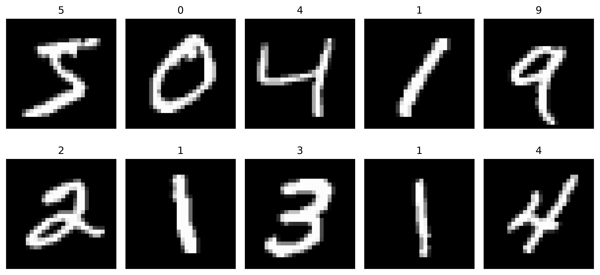
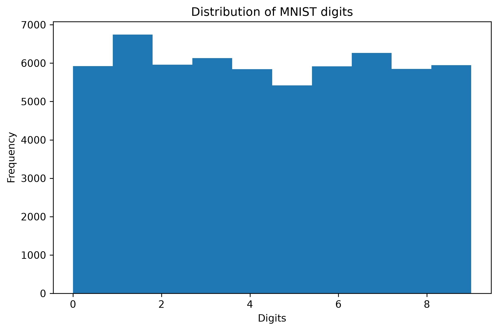
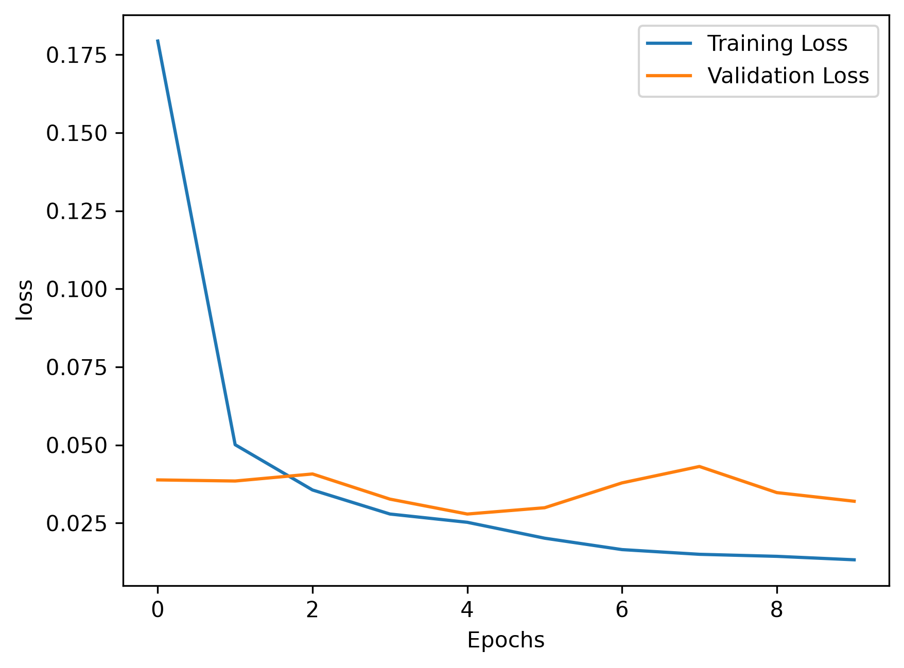
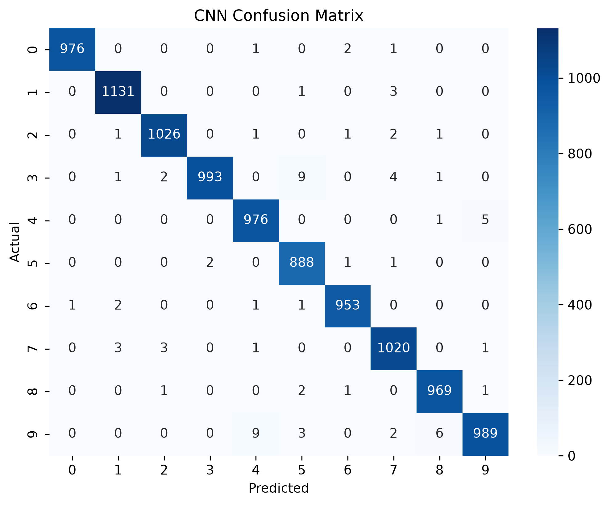
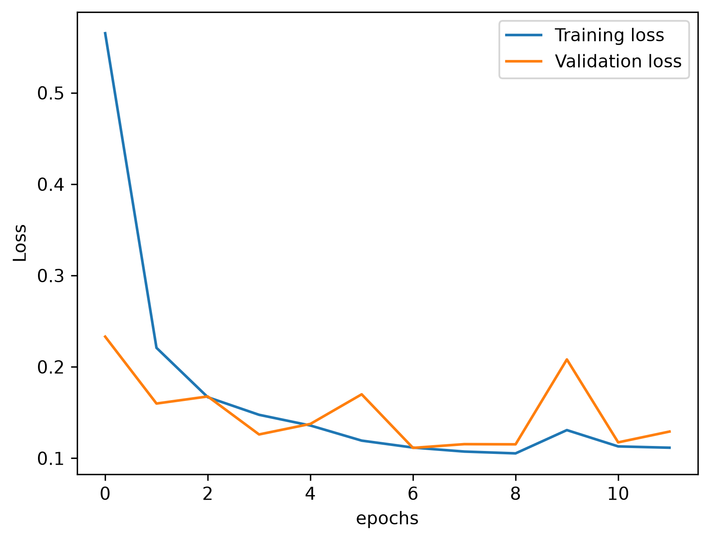
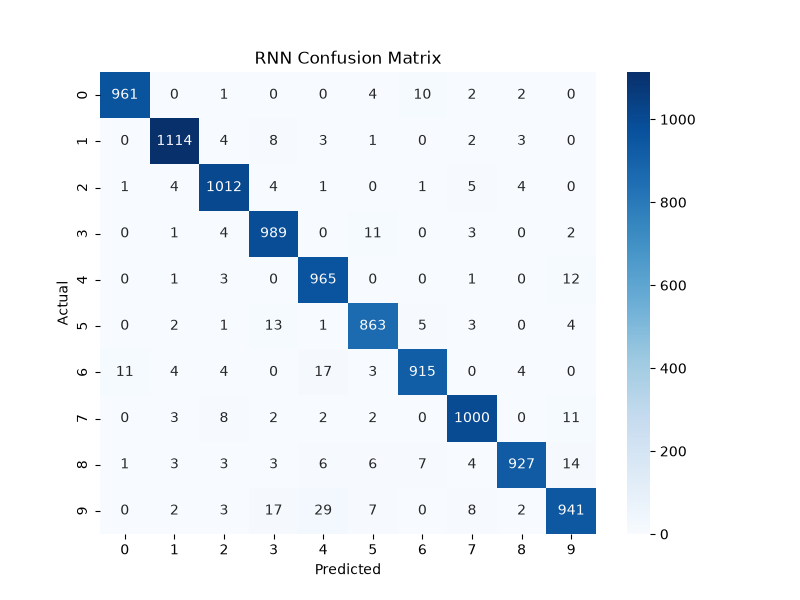

<div align="center">

#  MNIST Handwritten Digit Classification using CNN & RNN

### Deep Learning Project using PyTorch


A comparative study of **Convolutional Neural Networks (CNN)** and **Recurrent Neural Networks (RNN)** for handwritten digit classification using the **MNIST dataset**.

⭐ If you like this project, don't forget to star this repository.

</div>

---

# 📌 Project Overview

This project demonstrates the implementation and comparison of two popular Deep Learning architectures:

-  Convolutional Neural Network (CNN)
-  Recurrent Neural Network (RNN)

Both models are implemented using **PyTorch**, trained on the **MNIST Handwritten Digit Dataset**, and evaluated using multiple performance metrics.

The project also includes:

- Early Stopping
- Best Model Saving & Loading
- Confusion Matrix
- Classification Report
- Training & Validation Loss Curves
- Model Performance Comparison

---

#  Objectives

- Build a CNN for image classification.
- Build an RNN by treating images as sequential data.
- Compare CNN and RNN performance.
- Visualize model performance.
- Analyze classification results.

---

#  Dataset

**Dataset:** MNIST Handwritten Digits

- 70,000 grayscale images
- Image Size: **28 × 28**
- Training Samples: **60,000**
- Testing Samples: **10,000**
- Number of Classes: **10 (Digits 0–9)**

---

#  Sample Images

<p align="center">

</p>

---

#  Dataset Distribution

<p align="center">

</p>

---

# 🛠️ Tech Stack

| Category | Technology |
|-----------|------------|
| Language | Python |
| Framework | PyTorch |
| Dataset | Torchvision (MNIST) |
| Visualization | Matplotlib, Seaborn |
| Data Handling | NumPy, Pandas |
| Evaluation | Scikit-learn |
| IDE | Jupyter Notebook |

---

#  CNN Architecture

```
Input Image (1 × 28 × 28)

↓

Conv2D

↓

ReLU

↓

MaxPool

↓

Conv2D

↓

ReLU

↓

MaxPool

↓

Conv2D

↓

ReLU

↓

MaxPool

↓

Conv2D

↓

ReLU

↓

MaxPool

↓

Flatten

↓

Fully Connected Layer

↓

Output (10 Classes)
```

---

## CNN Training Curve

<p align="center">

</p>

---

## CNN Confusion Matrix

<p align="center">

</p>

---

#  RNN Architecture

Each image is treated as a sequence.

```
28 × 28 Image

↓

28 Time Steps

↓

Each Time Step = 28 Features

↓

RNN

↓

Hidden State

↓

Fully Connected Layer

↓

Output (10 Classes)
```

---

## RNN Training Curve

<p align="center">

</p>

---

## RNN Confusion Matrix

<p align="center">

</p>

---

# ⚙️ Hyperparameters

## CNN

| Parameter | Value |
|-----------|------:|
| Optimizer | Adam |
| Loss Function | CrossEntropyLoss |
| Epochs | 30 |
| Early Stopping | Yes |
| Patience | 5 |

---

## RNN

| Parameter | Value |
|-----------|------:|
| Hidden Size | 128 |
| Number of Layers | 2 |
| Optimizer | Adam |
| Loss Function | CrossEntropyLoss |
| Epochs | 30 |
| Early Stopping | Yes |
| Patience | 5 |

---

# 📈 Results

| Model | Test Accuracy |
|--------|--------------:|
|  CNN | **99.15%** |
|  RNN | **96.72%** |

---

#  Evaluation Metrics

The models were evaluated using:

-  Accuracy
-  Confusion Matrix
-  Classification Report
-  Training Loss
-  Validation Loss

---

# 💡 Key Observations

- CNN achieved higher accuracy because convolutional layers effectively learn spatial features.
- RNN treats images as sequential data and achieved competitive performance.
- Early Stopping reduced overfitting by saving the best-performing model.
- CNN is more suitable for image classification tasks, while RNN is primarily designed for sequential data.

---

# 📁 Project Structure

```
MNIST-Handwritten-Digit-Classification
│
├── notebook/
│   └── MNIST.ipynb
│
├── images/
│   ├── sample_digits.png
│   ├── dataset_distribution.png
│   ├── cnn_loss_graph.png
│   ├── cnn_confusion_matrix_heatmap.png
│   ├── rnn_loss_graph.png
│   └── rnn_confusion_matrix_heatmap.png
│
├── model/
│   ├── cnn_best_model.pth
│   └── rnn_best_model.pth
│
├── results/
│   └── comparison_table.csv
│
├── requirements.txt
├── README.md
├── LICENSE
└── .gitignore
```

---

# 🚀 Installation

Clone the repository

```bash
git clone https://github.com/mayankptdr/MNIST-Handwritten-Digit-Classification.git
```

Move into the project folder

```bash
cd MNIST-Handwritten-Digit-Classification
```

Install dependencies

```bash
pip install -r requirements.txt
```

Launch Jupyter Notebook

```bash
jupyter notebook
```

---


# 👨‍💻 Author

## **Mayank Patidar**

🔗 GitHub: https://github.com/mayankptdr

---

<div align="center">

### ⭐ If you found this project useful, consider giving it a Star!

Made with ❤️ using PyTorch

</div>
